# computer-graphics-Hierarchical-Mesh-Decomposition-using-Fuzzy-Clustering-and-Cuts

C++ implements of 

[Hierarchical-Mesh-Decomposition]: https://dl.acm.org/doi/10.1145/882262.882369


## Dependence

CMake

Eigen

gtest


## Run

```bash
mkdir build
```

```bash
cd build
```

```bash
cmake ..
```

```bash
make
```

```bash
cd ..
```

```bash
./segmentNet
```


## Parameters


fuzzy-threshold: the difference between the normalized top 2 probability ; if not exceeds, then the vertice belongs to the fuzzy part


stop_dis_ratio: the max distance between the representatives divide the max distance of the origin mesh; if exceeds, the segmentation stops


stop_ang_ratio: the difference between the max dihedral angle and the min dihedral divide the max dihedral angle. if not exceeds, the segmentation stops


## Examples


- stop_dis_ratio = 0.03 ; stop_ang_ratio = 0.05

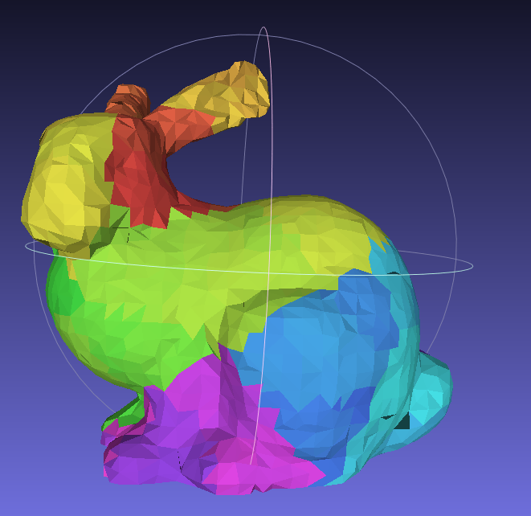

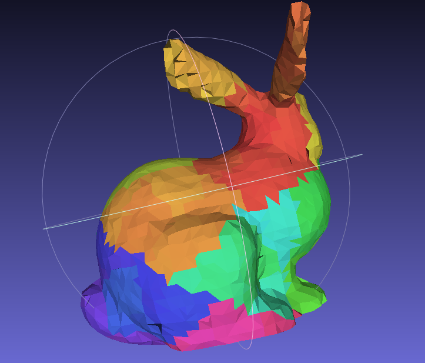

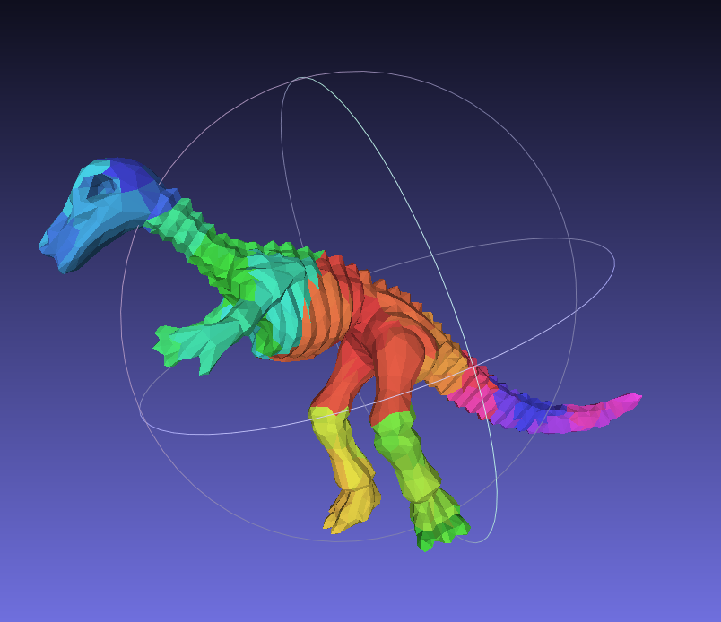

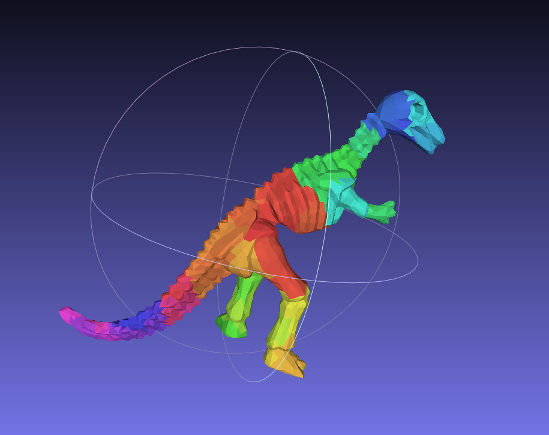

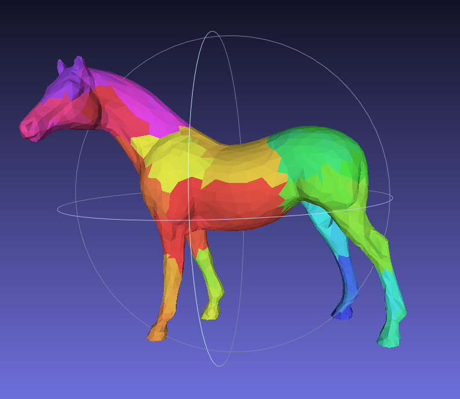

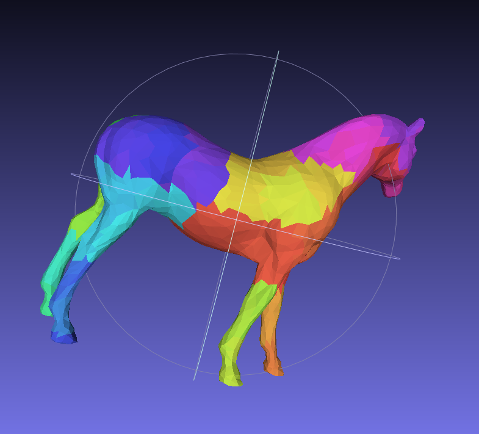


- stop_dis_ratio = 0.2 ; stop_ang_ratio = 0.3


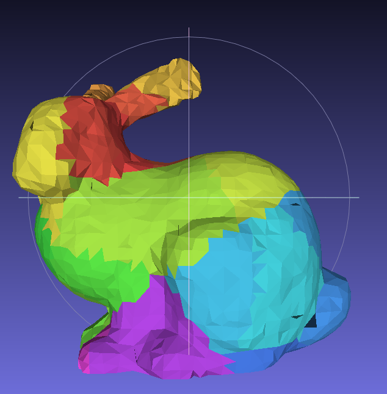

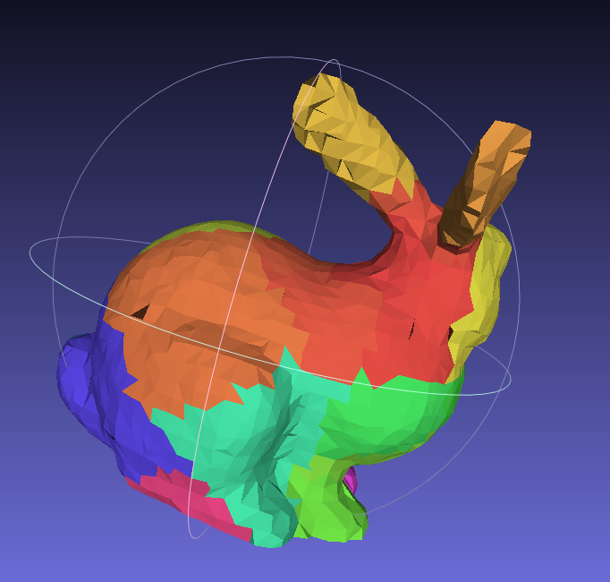

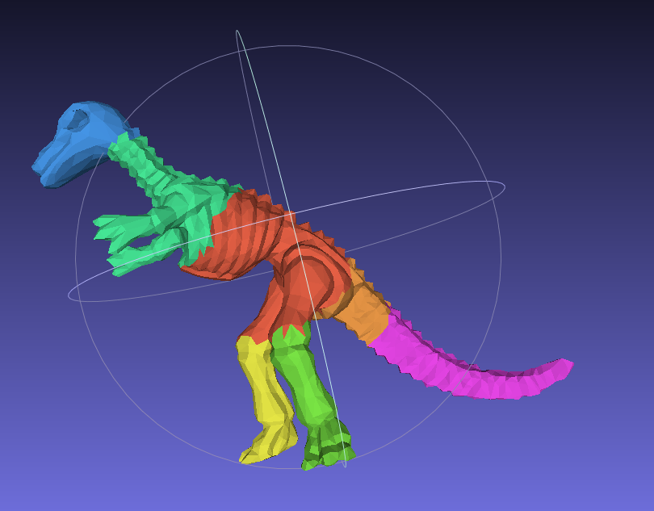

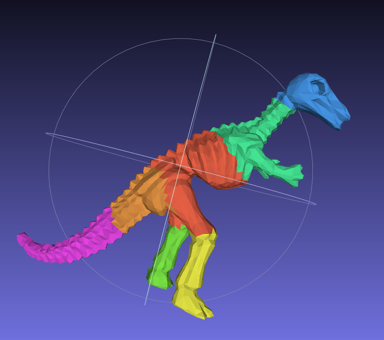

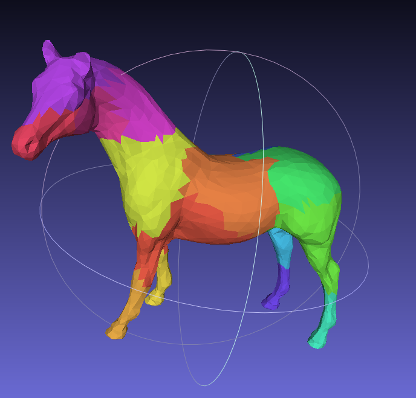

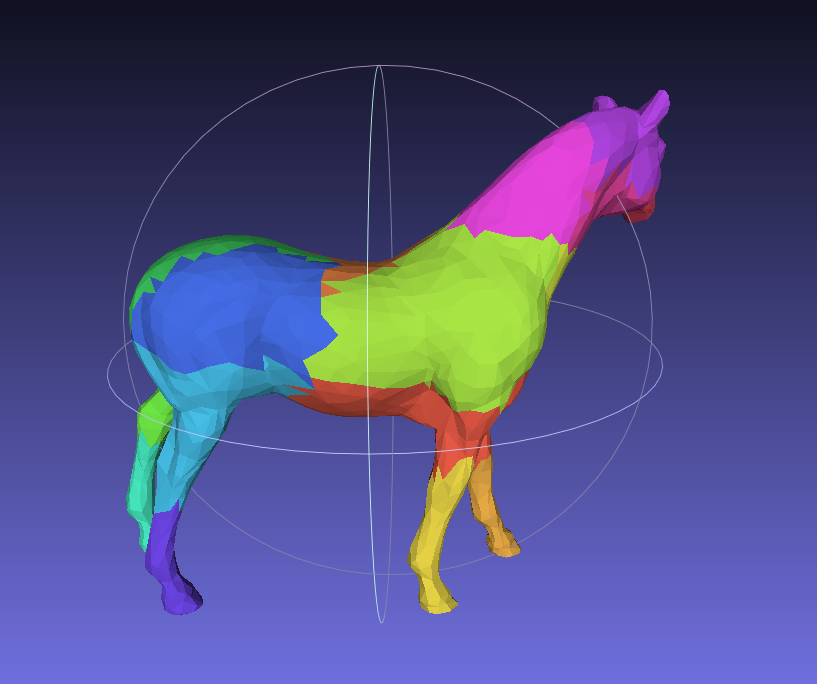


- stop_dis_ratio = 0.4 ; stop_ang_ratio = 0.5

  

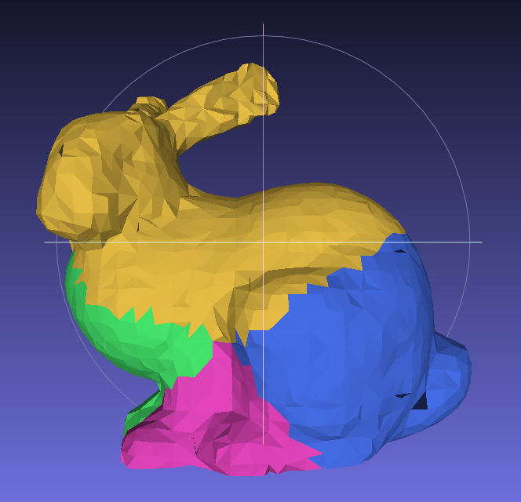

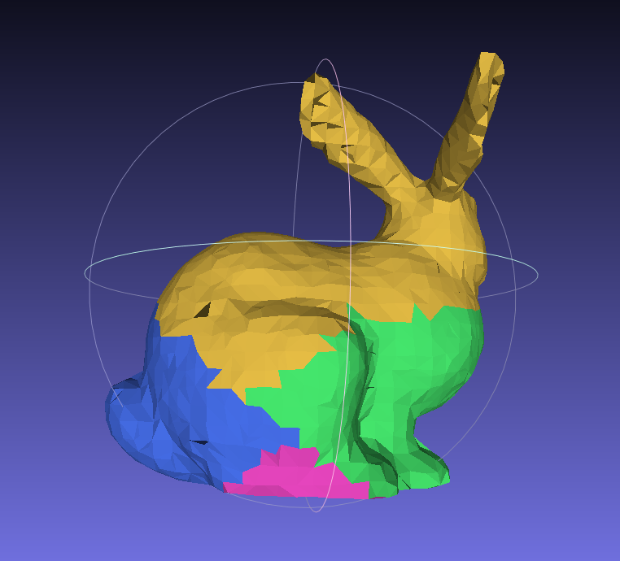

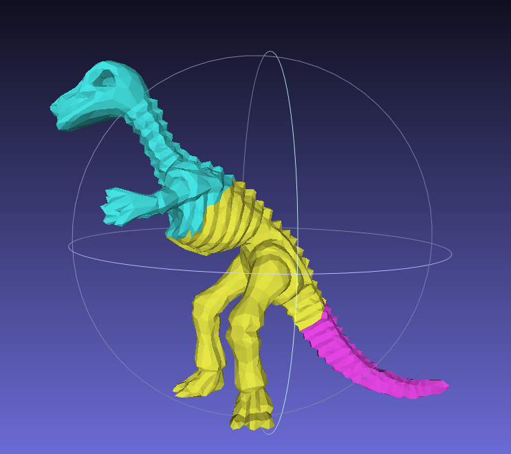

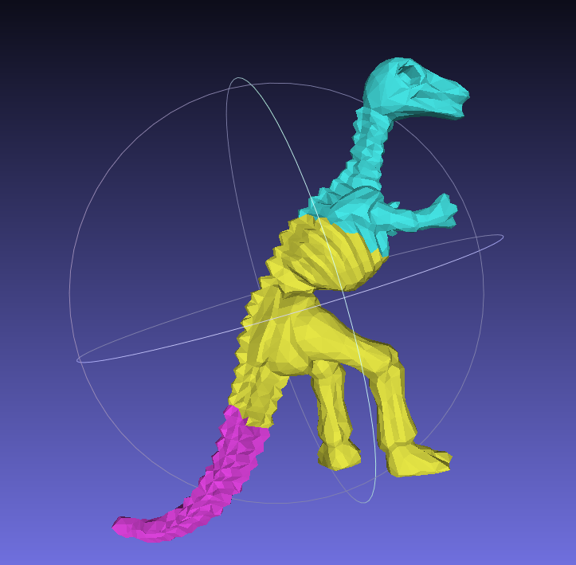

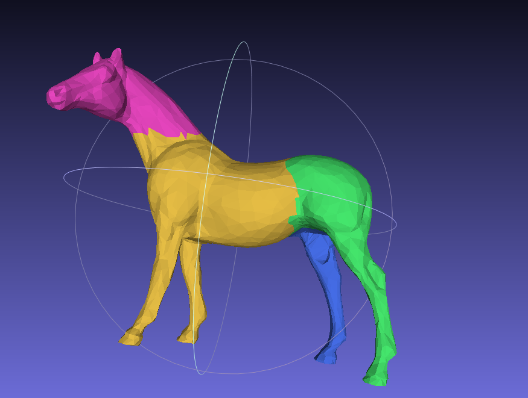

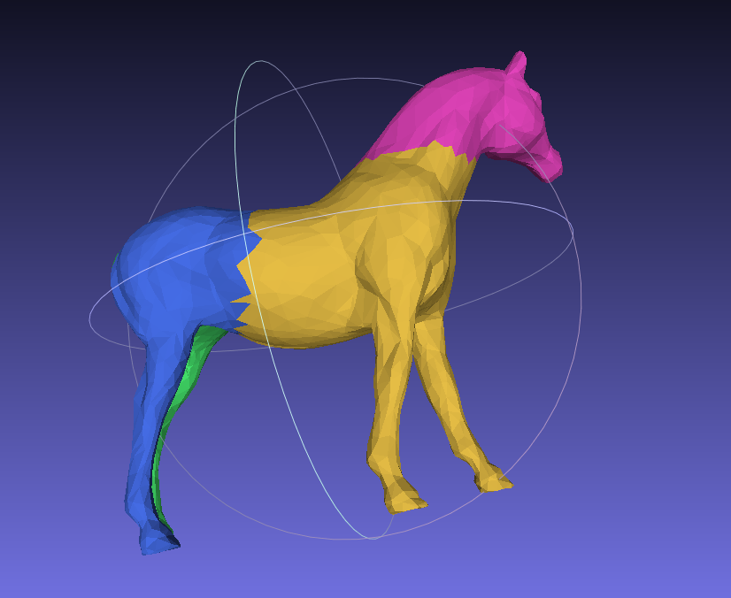
